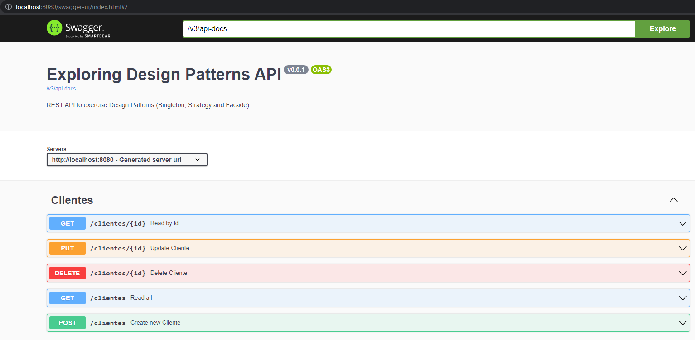

# Exploring Desing Patterns With Java
### Swagger UI


## About
REST API to exercise some Design Patterns (Singleton, Strategy and Facade).

Created with **Java**, **Spring Boot** and built with **Gradle**.

## Why
A challenge of the [Québec Java Digital] bootcamp offered by [Québec Government] and [Digital Innovation One].

## Installation
### Prerequisits
- Java 11

### How to install
Clone the repository and build with gradle.

## Usage
Run with gradle.

In your web browser, access:
```
https://localhost:8080
```

## Reference
DIO Expert base implementation: https://github.com/digitalinnovationone/lab-padroes-projeto-spring

[Québec Java Digital]: https://www.dio.me/bootcamp/quebec-java-digital
[Québec Government]: https://www.quebec.ca/en/
[Digital Innovation One]: https://www.dio.me/
